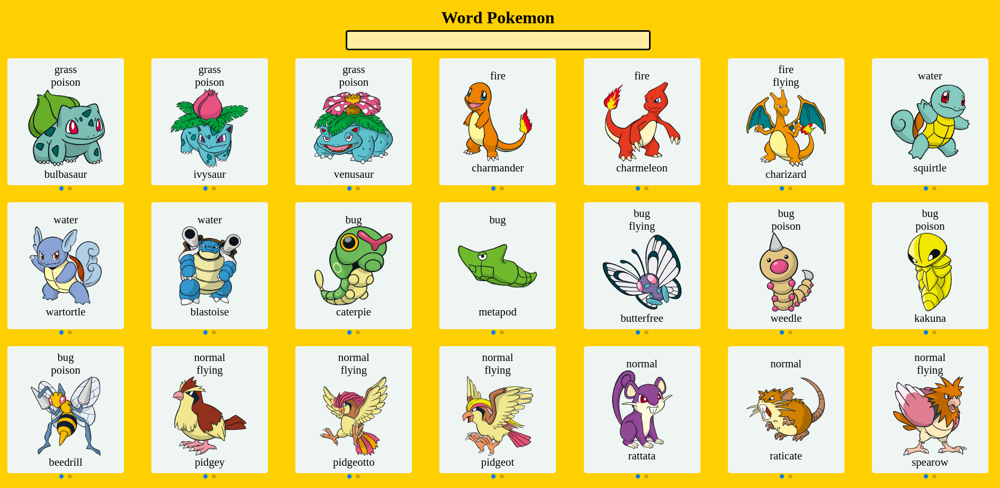
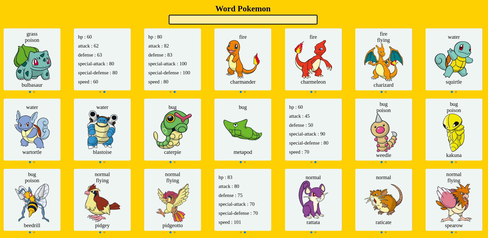
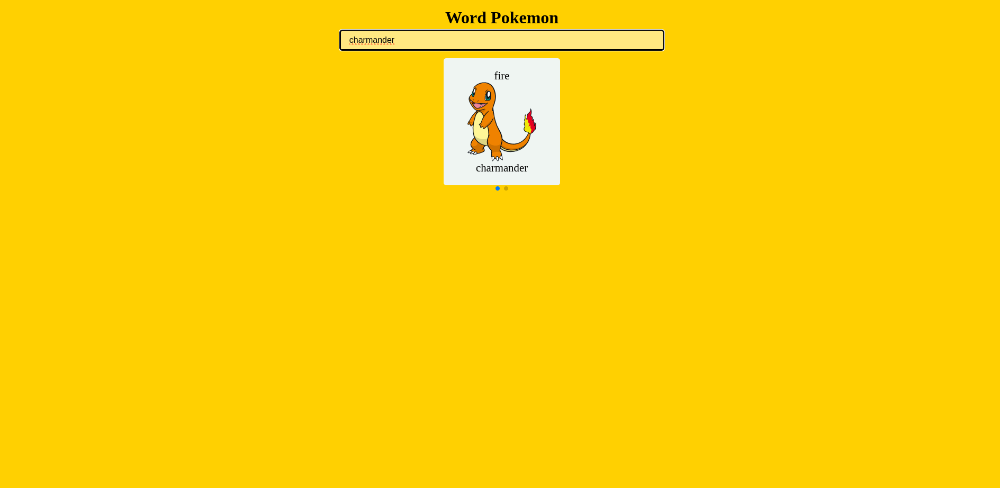

# Word-pokemon

## Este projeto é um teste utilizando a api PokeAPI v2 para avaliação de desenvolvimento de projeto

# Dificuldades

## A parte mais difícil foi entender como a api funciona, ela tem muito dados mesmo e não tem uma exata direção de onde eles estão exatamente, além de filtrar vários pokemons pelo id aproveitar as informações como foto, attack etc, já que a api utiliza bastante objetos encadeados

# Aprendizado

## Sinceramente eu quase desisto quando cheguei na parte de listar os pokemons pelo id, apesar de ser uma das partes principais, eu gostaria de feitos com outras ferramentas como, por exemplo, utilizando o swr, para fazer paginação, etc., uma coisa mais elabora, porém, por limitações do mesmo não foi possível, então eu acabei optando por simplificar, no final eu aprendi a ter mais calma para resolver os problemas além tudo ser mais questão de encaixe e analisar mais as situações

# Comentários

## Espero que tenham gostado, qualquer dúvida me mandem por e-mail, ficarei feliz em poder ajudar, também quero deixar claro que utilizei o react por já ter conhecimento prévio do contrário eu teria usado vue.js como pedido, foi apenas pela questão de prazo e eu realmente queria entregar este desafio a tempo, aprender uma nova tecnologia iria levar mais tempo e eu escolhi focar mais na entrega

